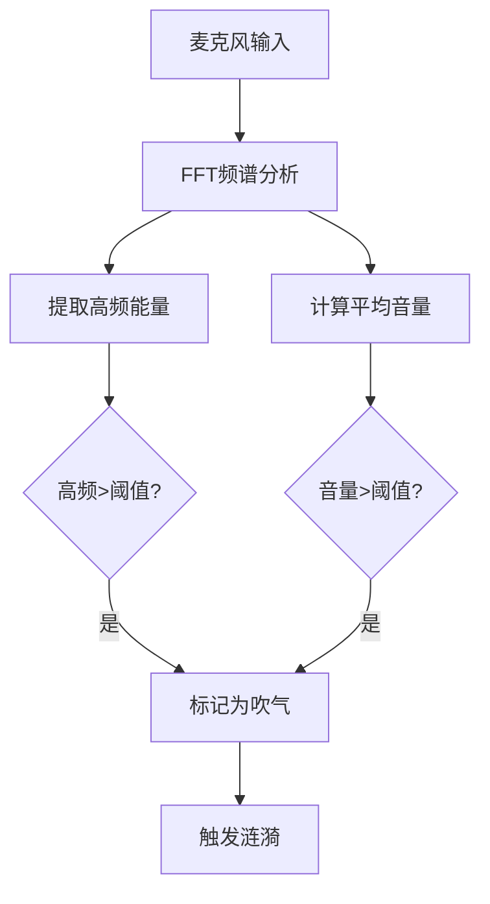

# 风之涟漪系统 - 完整说明文档

## 📋 目录

- [系统概述](#系统概述)
- [快速开始](#快速开始)
- [组件详解](#组件详解)
- [参数配置](#参数配置)
- [高级功能](#高级功能)
- [故障排除](#故障排除)

---

## 🎮 系统概述

### 功能特点

风之涟漪系统是一个基于麦克风输入的交互系统，具有以下特点：

- ✨ **智能吹气检测**：使用频谱分析识别风声，区分吹气和说话
- 🌊 **Shader涟漪效果**：透明背景，只有波纹可见，支持广告牌效果
- 📊 **动态速度响应**：涟漪速度根据吹气强度实时变化
- 🎛️ **高度可配置**：所有参数都可在Inspector中调整

### 核心组件

| 组件 | 说明 |
|------|------|
| `WindInput` | 麦克风输入和吹气检测 |
| `WindRippleController` | 涟漪效果控制器 |
| `WindInteractable` | 可互动物体的基类 |
| `LakeRipple` | 粒子涟漪效果（旧版） |

---

## 🚀 快速开始

### 步骤1：创建涟漪触发器

1. 在Unity Hierarchy中右键 → **Create Empty**
2. 命名为 "RippleTrigger"
3. 添加组件：**Component → Scripts → WindRippleController**
4. 完成！

### 步骤2：运行测试

1. 点击 **Play**
2. 前2秒保持安静（自动校准噪音）
3. 对着麦克风吹气
4. 观察涟漪效果 ✨

---

## 🔧 组件详解

### WindInput - 吹气检测系统

**位置**: 场景中任意物体（通常放在主摄像机或Manager对象）

#### 核心功能

- 实时麦克风音频分析
- 频谱分析识别风声特征
- 自动噪音校准
- 双重判断机制（音量 + 高频能量）

#### 参数说明

##### 吹气检测参数

| 参数 | 默认值 | 说明 |
|------|--------|------|
| `volumeThreshold` | 0.15 | 音量阈值，越大越难触发 |
| `highFreqThreshold` | 0.2 | 高频能量阈值，用于识别风声 |
| `useHighFreqDetection` | 开启 | 是否启用高频检测（推荐开启） |
| `noiseFloor` | 0.05 | 噪音抑制强度 |
| `smoothing` | 0.3 | 平滑系数，越大越平滑 |

##### 调试UI（可选）

| 参数 | 说明 |
|------|------|
| `volumeSlider` | 音量显示条 |
| `volumeText` | 音量数值文本 |

### WindRippleController - 涟漪控制器

**功能**: 控制涟漪的显示、动画和效果

#### 参数说明

##### 涟漪参数

| 参数 | 默认值 | 说明 |
|------|--------|------|
| `rippleStrength` | 0.5 | 涟漪强度（0-2） |
| `rippleSpeed` | 2.0 | 涟漪扩散速度 |
| `rippleFrequency` | 30.0 | 波纹密集度（10-50） |
| `fadeOutTime` | 1.5 | 淡出时间（秒） |
| `maxRadius` | 1.0 | 涟漪最大范围（0-1） |
| `edgeFade` | 0.2 | 边缘渐隐范围（0-0.5） |

##### 发射器设置

| 参数 | 说明 |
|------|------|
| `randomCenter` | 随机涟漪中心 |
| `centerOffset` | 涟漪中心偏移 |

##### 广告牌设置

| 参数 | 说明 |
|------|------|
| `billboard` | 是否启用广告牌效果（始终面向摄像机） |
| `mainCamera` | 摄像机引用（为空则自动查找） |

##### 音量响应设置

| 参数 | 默认值 | 说明 |
|------|--------|------|
| `useVolumeResponse` | 关闭 | 是否使用音量响应 |
| `minVolume` | 0.3 | 最小触发音量 |
| `maxVolume` | 1.0 | 最大触发音量 |
| `minSpeed` | 1.0 | 最慢扩散速度 |
| `maxSpeed` | 5.0 | 最快扩散速度 |
| `volumeToSpeedCurve` | 线性 | 音量到速度的映射曲线 |

---

## ⚙️ 参数配置

### 推荐配置

#### 基础配置（推荐）

```yaml
WindInput:
  volumeThreshold: 0.15
  highFreqThreshold: 0.2
  useHighFreqDetection: true
  noiseFloor: 0.05
  smoothing: 0.3

WindRippleController:
  threshold: 0.3
  rippleStrength: 0.5
  rippleSpeed: 2.0
  rippleFrequency: 30.0
  fadeOutTime: 1.5
  maxRadius: 1.0
  edgeFade: 0.2
  billboard: true
  useVolumeResponse: false
```

#### 高性能配置

```yaml
WindInput:
  volumeThreshold: 0.1
  highFreqThreshold: 0.15
  useHighFreqDetection: true

WindRippleController:
  rippleStrength: 1.2
  rippleSpeed: 3.0
  rippleFrequency: 40.0
  maxRadius: 0.8
  edgeFade: 0.15
  useVolumeResponse: true
  minSpeed: 1.5
  maxSpeed: 8.0
```

#### 调试配置

```yaml
WindInput:
  volumeThreshold: 0.08
  useHighFreqDetection: false  # 关闭高频检测便于调试

WindRippleController:
  rippleStrength: 1.0
  useVolumeResponse: true
```

### 参数调优指南

#### 触发达标困难

**症状**: 需要很用力吹才能触发

**解决方案**:
```yaml
WindInput:
  volumeThreshold: 0.1  # 降低阈值
  
WindRippleController:
  threshold: 0.2  # 降低触发阈值
```

#### 误触发太多

**症状**: 说话也会触发

**解决方案**:
```yaml
WindInput:
  highFreqThreshold: 0.25  # 提高高频阈值
  useHighFreqDetection: true  # 确保开启
```

#### 涟漪太快/太慢

**解决方案**:
```yaml
WindRippleController:
  rippleSpeed: 1.5  # 调整速度
```

#### 涟漪太强/太弱

**解决方案**:
```yaml
WindRippleController:
  rippleStrength: 0.3  # 降低强度
  # 或
  rippleStrength: 1.5  # 增强强度
```

---

## 🎨 高级功能

### 音量响应功能

启用后，涟漪速度会根据吹气强度实时变化。

#### 启用方法

1. 在 `WindRippleController` 中勾选 `useVolumeResponse`
2. 设置速度范围：
   - `minSpeed`: 0.5 - 1.5（小声）
   - `maxSpeed`: 3.0 - 8.0（大声）
3. 调整映射曲线（可选）

#### 效果

- 轻声吹气 → 涟漪缓慢扩散
- 用力吹气 → 涟漪快速扩散
- 中等强度 → 速度适中

### 自定义涟漪材质

#### 创建材质

1. Project窗口右键 → **Create → Material**
2. Shader选择 `Custom/RippleShader`
3. 调整颜色和参数
4. 应用到物体

#### 材质参数

| 参数 | 说明 | 推荐值 |
|------|------|--------|
| `_Color` | 涟漪颜色 | 水蓝色 (0.5, 0.7, 1, 0.8) |
| `_RippleStrength` | 强度 | 0.8 - 1.2 |
| `_RippleFrequency` | 频率 | 25 - 35 |
| `_MaxRadius` | 最大范围 | 0.5 - 1.0 |
| `_EdgeFade` | 边缘渐隐 | 0.15 - 0.25 |

### 多个涟漪触发器

可以创建多个 `WindRippleController` 来实现复杂的涟漪效果：

```csharp
// 场景布局示例
RippleZone_A (强触发)
  - threshold: 0.4
  - rippleStrength: 1.5
  
RippleZone_B (弱触发)
  - threshold: 0.15
  - rippleStrength: 0.8
  
RippleZone_C (快速触发)
  - threshold: 0.3
  - rippleSpeed: 5.0
```

---

## 🛠️ 故障排除

### 常见问题

#### 问题1：麦克风无响应

**症状**: 对麦克风吹气无反应

**检查清单**:
1. ✓ 检查Unity麦克风权限
2. ✓ 确认麦克风设备正常工作
3. ✓ 查看Console是否有错误信息
4. ✓ 检查 `WindInput` 组件是否存在

**解决方案**:
```csharp
// 在代码中检查麦克风设备
Debug.Log("麦克风设备: " + Microphone.devices.Length);
foreach(string device in Microphone.devices)
{
    Debug.Log(device);
}
```

#### 问题2：说话也会触发

**症状**: 正常说话就能触发涟漪

**解决方案**:
```yaml
WindInput:
  highFreqThreshold: 0.3  # 提高阈值
  useHighFreqDetection: true  # 确保开启
```

#### 问题3：背景不透明

**症状**: 可以看到Quad的背景

**解决方案**:
1. 确认Shader是 `Custom/RippleShader`
2. 检查材质的 `_Color` Alpha值
3. 重新导入Shader

#### 问题4：触发不稳定

**症状**: 触发时有时无

**解决方案**:
```yaml
WindInput:
  smoothing: 0.5  # 增加平滑度
  
WindRippleController:
  threshold: 0.25  # 稍微降低触发阈值
```

#### 问题5：涟漪太小/太大

**解决方案**:
```yaml
# 调整物体缩放
RippleTrigger:
  transform.scale: (3, 3, 1)  # 3倍大小

# 或调整Shader参数
WindRippleController:
  maxRadius: 0.5  # 限制扩散范围
```

### 调试技巧

#### 启用详细日志

```csharp
// 在WindInput中添加
Debug.Log($"音量: {volume:F2}, 高频: {highFreqEnergy:F2}, 触发: {IsBlowing}");
```

#### 使用调试UI

1. 创建Canvas
2. 添加Slider和Text组件
3. 绑定到 `WindInput` 的调试字段
4. 实时观察音量变化

#### 频谱可视化（可选）

使用Unity Profiler的Audio分析功能查看麦克风频谱：

1. Window → Analysis → Profiler
2. 选择 Audio 模块
3. 播放游戏并观察频谱

---

## 📚 技术细节

### 吹气检测原理

#### 频谱分析

系统使用FFT（快速傅里叶变换）分析音频频谱：

- **风声特征**: 高频能量集中在 2kHz - 10kHz
- **人声特征**: 能量集中在 300Hz - 3kHz
- **区分方法**: 检测高频能量是否超过阈值

#### 算法流程



#### 噪音校准

启动后前2秒（120帧）自动校准：

1. 采样环境噪音
2. 记录最大噪音值作为基线
3. 后续检测减去基线值
4. 减少误触发

### Shader原理

#### 涟漪波纹计算

```glsl
// 计算从中心的距离
float dist = length(centerUV * 2);

// 创建波纹效果
float wave = dist - spread * time;
float ripple = abs(sin(wave * frequency));

// 边缘渐隐
float edgeFade = smoothstep(0, _EdgeFade, distToEdge);
```

#### 透明度控制

```glsl
// 范围限制
float radiusMask = step(dist, _MaxRadius);

// 最终alpha
alpha = ripple * radiusMask * edgeFade * fadeOut;

// 丢弃无效像素
if (alpha < 0.02) discard;
```

---

## 📖 API参考

### WindInput

#### 公共属性

```csharp
public bool IsBlowing { get; }  // 当前是否在吹气
public float Volume { get; }    // 当前音量（0-1）
public float HighFreqEnergy { get; }  // 高频能量
```

#### 公共方法

```csharp
void RecalibrateNoise()  // 重新校准噪音基线
```

### WindRippleController

#### 继承关系

```
MonoBehaviour
└── WindInteractable
    └── WindRippleController
```

#### 核心方法

```csharp
protected override void Update()  // 音量响应更新
protected override void OnBlow()  // 触发涟漪
void StartRipple()  // 开始涟漪动画
void LateUpdate()  // 广告牌效果更新
```

### WindInteractable

#### 抽象方法

```csharp
protected abstract void OnBlow();  // 子类实现
```

---

## 🎯 最佳实践

### 性能优化

1. **限制同时涟漪数量**: 避免创建过多触发器
2. **使用对象池**: 如果需要大量涟漪效果
3. **关闭不需要的检测**: 在不需要时关闭 `useVolumeResponse`

### 用户体验

1. **提供视觉反馈**: 添加提示文字（如"请对着麦克风吹气"）
2. **设置合理的阈值**: 不要设置得太难或太容易
3. **测试不同设备**: 不同麦克风灵敏度不同

### 代码组织

```
Assets/
├── 脚本/
│   ├── WindInput.cs              # 输入系统
│   ├── WindRippleController.cs   # 涟漪控制器
│   ├── WindInteractable.cs       # 基类
│   └── 其他组件...
├── 材质/
│   └── RippleShader.shader       # 涟漪Shader
└── Scenes/
    └── 游戏场景...
```

---

## 📝 更新日志

### v1.0 - 完整功能

- ✅ 智能吹气检测
- ✅ Shader涟漪效果
- ✅ 广告牌支持
- ✅ 音量响应
- ✅ 范围和边缘控制
- ✅ 透明背景

---

## 💡 示例场景

### 基础场景

```csharp
// 场景：开场展示
GameObject rippleTrigger = new GameObject("RippleTrigger");
WindRippleController controller = rippleTrigger.AddComponent<WindRippleController>();

// 配置为开场效果
controller.rippleStrength = 1.0f;
controller.fadeOutTime = 3.0f;
controller.threshold = 0.2f;
```

### 交互场景

```csharp
// 场景：多个触发器
// 调整不同位置的涟漪参数
foreach(GameObject trigger in rippleTriggers)
{
    WindRippleController ctrl = trigger.GetComponent<WindRippleController>();
    ctrl.threshold = Random.Range(0.2f, 0.4f);  // 随机触发阈值
    ctrl.rippleSpeed = Random.Range(1.5f, 3.0f);  // 随机速度
}
```

---

## 🤝 贡献

如有问题或建议，请联系开发团队。

---

**版本**: 1.0  
**最后更新**: 2025.1027.1412

